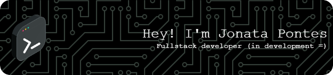

# Perfil de Desenvolvedor ( 🚧 Em Construção )

## Olá! 👋

Bem-vindo(a) ao meu perfil do GitHub! Eu sou Jonata Pontes, um desenvolvedor apaixonado por tecnologia e sempre em busca de novos desafios. Aqui você encontrará uma variedade de projetos nos quais tenho trabalhado, desde aplicativos web a soluções de software. 
Eu sou um cara muito curioso e preguiçoso. 
Com essas belas descrições, decidi cair de cara na área de Desenvolvimento para criar ferramentas que facilite e otimize tempo, nas diversas aplicações possíveis.

## 📊 Estatísticas do GitHub

 

   <a href="https://github.com/jonatapontesdev">
   
   

## 🚀 Habilidades Técnicas
<!--
 
  
  
  
  

 

 
  

 -->

   <a href="https://github.com/jonatapontesdev">
  

 

   <a href="https://github.com/jonatapontesdev">
  

 
   <a href="https://github.com/jonatapontesdev">
  

 

  ## 📫 Como me encontrar
 

 
  
  
   
 
  

**Obrigado por visitar!** 😄
